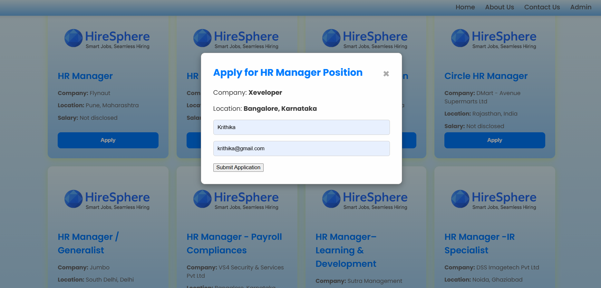
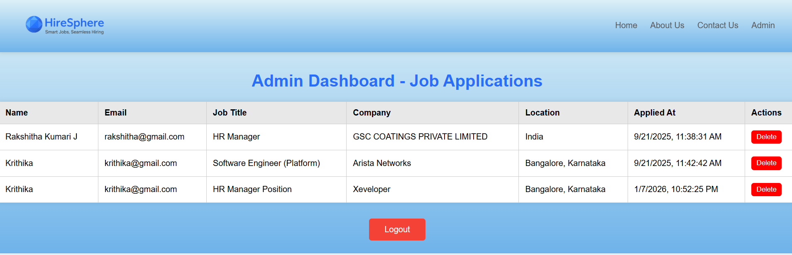

# HireSphere – Job Search Website 🌐

HireSphere is a web-based **Job Search and Application Platform** designed to help job seekers find relevant job opportunities and apply easily through an interactive and user-friendly interface.  
The platform also includes an **Admin Dashboard** to manage and monitor job applications.

This project was developed as an **academic mini project**.

## 🎯 Project Objective
To simplify the job searching process by providing:
- Easy job discovery based on role and location
- Online job application functionality
- Admin-side application management

## 🚀 Key Features

### 👤 User Module
- Welcome page with dynamic greeting
- User registration and login
- Live job search using Adzuna Jobs API
- Location-based job filtering
- Job application form
- Responsive and modern UI

### 🛠️ Admin Module
- Admin login authentication
- View submitted job applications
- Delete applications
- Secure logout functionality

## 🧠 Technologies Used
- **HTML5** – Page structure
- **CSS3** – Styling and responsiveness
- **JavaScript** – Client-side logic
- **Adzuna Jobs API** – Live job data
- **Browser LocalStorage** – Data persistence

## 👩‍💻 Project Team
- **Krithika**
- **Rakshitha**

## 📸 Project Screenshots

### Home Page

### Job Card  

### Dashboard

## 📌 Note
- This project is built using **frontend technologies only**
- No backend or database is used
- Intended for **educational and demonstration purposes**

## 📢 Acknowledgment
This project was developed as part of an academic mini project to gain practical experience in web development.

#HireSphere #JobSearchWebsite #WebDevelopment #HTML #CSS #JavaScript
